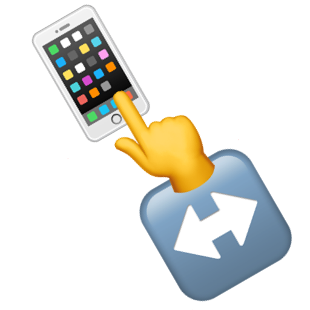

#  StrokeView



`StrokeView` is handlable round trip gesture on extended  `UIView`.

# Usage

```swift
class ViewController: UIViewController, StrokeViewDelegate {

    override func viewDidLoad() {
        super.viewDidLoad()

        let strokeView: StrokeView = StrokeView()
        strokeView.delegate = self
        view.addSubview(strokeView)
    }

    func strokeViewDidStroke(_ strokeView: StrokeView) {
        print("did stroke!!!")
    }
}
```
